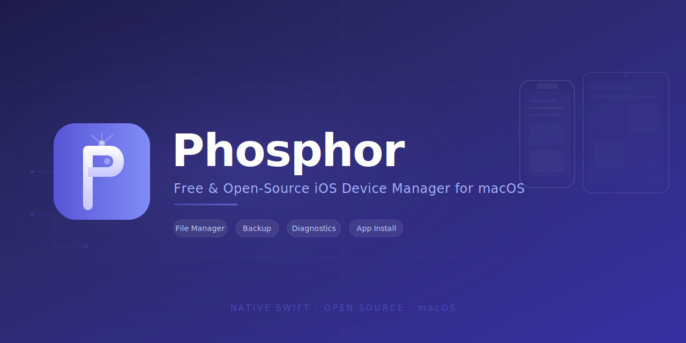

<p align="center">
  
</p>

<p align="center">
  
</p>

<h1 align="center">Phosphor</h1>

<p align="center">
  <strong>Free and open-source iOS device manager for macOS.</strong><br>
  <a href="https://github.com/momenbasel/Phosphor/releases/latest">Download</a> -
  <a href="https://momenbasel.github.io/Phosphor/">Website</a> -
  <a href="#features">Features</a> -
  <a href="#installation">Install</a>
</p>

<p align="center">
  <a href="https://github.com/momenbasel/Phosphor/releases/latest"></a>
  <a href="https://github.com/momenbasel/Phosphor/blob/main/LICENSE"></a>
  <a href="https://github.com/momenbasel/Phosphor/actions"></a>
  
  
</p>

---

Phosphor gives you complete control over your iPhone, iPad, and iPod touch without proprietary software, iCloud lock-in, or subscriptions. Built natively with SwiftUI and powered by [libimobiledevice](https://libimobiledevice.org/).

---

## Why Phosphor?

Apple's Finder integration is all-or-nothing. Proprietary tools like iMazing cost $50/year. Phosphor fills the gap:

| Feature | Finder | iMazing | Phosphor |
|---------|--------|---------|----------|
| Full device backup | Yes | Yes | Yes |
| Incremental backup | No | Yes | Yes |
| Browse backup contents | No | Yes | Yes |
| Selective file restore | No | Yes | Yes |
| Export iMessages to CSV/HTML | No | Yes | Yes |
| Export WhatsApp messages | No | Yes | Yes |
| Photo extraction (no iCloud) | No | Yes | Yes |
| App data extraction | No | Yes | Yes |
| Install/remove IPAs | No | Yes | Yes |
| Battery health diagnostics | No | Yes | Yes |
| Real-time device console | No | Yes | Yes |
| Device file system browser | No | Yes | Yes |
| Drag-and-drop file transfer | No | Yes | Yes |
| Scheduled Wi-Fi backups | No | Yes | Yes |
| Time Machine backup restore | No | No | **Yes** |
| Contacts export (vCard/CSV) | No | Yes | Yes |
| Calendar export (ICS/CSV) | No | Yes | Yes |
| Apple Watch data browsing | No | Yes | Yes |
| Backup archive format | No | .imazing | **.phosphor** |
| Localization (7 languages) | No | Yes | Yes |
| Price | Free | $49.99/yr | Free |
| Open source | No | No | **MIT** |

## Features

### Device Management
- Automatic detection of connected iOS devices via USB
- Device info: model, iOS version, serial, UDID, IMEI, Wi-Fi/Bluetooth MAC
- Pair/unpair devices
- Restart, shutdown, sleep commands
- Take device screenshots

### Backups
- Create full and incremental local backups (no iCloud required)
- Browse backup contents through parsed `Manifest.db`
- Navigate by domain (Camera Roll, Apps, Home, System, Keychain, etc.)
- Search files across the entire backup
- Extract individual files or entire domains
- Manage backup encryption
- Delete old backups

### Messages
- Browse all iMessage and SMS conversations from backups
- View messages in a native chat-bubble interface
- Search across all messages
- Export conversations to **CSV**, **HTML**, **Plain Text**, or **JSON**
- Export all conversations at once
- HTML export styled like native iMessage (blue/gray bubbles)

### Photos & Videos
- Browse Camera Roll from backup without restoring
- Filter by type: Photos, Videos, Screenshots
- Grid and list view modes
- Batch extract to any folder
- Preserves original filenames and structure

### Applications
- List all installed apps on connected devices
- Browse apps stored in backups with data sizes
- Install `.ipa` files directly to device
- Remove apps from device
- Extract individual app containers (Documents, Library, tmp)

### File System
- Mount device filesystem via AFC (Apple File Conduit)
- Navigate directories, view file metadata
- Copy files to/from device
- Mount specific app containers
- Delete files on device

### Contacts
- Browse all contacts from backup AddressBook database
- View phone numbers, emails, organization details
- Search across all contacts
- Export as **vCard (.vcf)** or **CSV**

### Calendar
- Browse calendars and events from backup
- View event details, duration, all-day status
- Export as **ICS (iCalendar)** or **CSV**

### Apple Watch
- View paired Apple Watch info from iPhone backup
- Browse WatchKit extension apps with data sizes
- Activity ring history (Move, Exercise, Stand)
- Extract all Watch-related data from backup

### Diagnostics
- Battery: current charge, charging status, health percentage, design vs. actual capacity (mAh)
- Storage: total capacity, usage breakdown (Apps, Photos, Media, Other), available space
- Visual storage bar similar to macOS About This Mac
- Real-time device system log (syslog) streaming
- Filter and search logs
- Export logs to file
- Color-coded log levels (Error/Warning/Debug)

### Backup Management
- **Time Machine mode**: 3D animated backup browser for visual restore
- **Scheduled backups**: automatic hourly/daily/weekly/monthly via USB or Wi-Fi
- **.phosphor archives**: portable backup export/import format
- Backup encryption management (enable/disable/verify)
- Drag-and-drop file transfer in file browser

## Installation

### Homebrew (recommended)

```bash
brew tap momenbasel/phosphor
brew install --cask phosphor
```

### Manual

1. Download the latest `.dmg` from [Releases](https://github.com/momenbasel/Phosphor/releases)
2. Drag `Phosphor.app` to Applications
3. Install dependencies: `brew install libimobiledevice ideviceinstaller ifuse`

### Build from Source

```bash
# Install dependencies
brew install libimobiledevice ideviceinstaller ifuse

# Clone and build
git clone https://github.com/momenbasel/Phosphor.git
cd Phosphor
swift build -c release

# Create app bundle
bash Scripts/build.sh

# Launch
open .build/Phosphor.app
```

## Requirements

- **macOS 14.0** (Sonoma) or later
- **libimobiledevice** (core device communication)
- **ideviceinstaller** (app management)
- **ifuse** (file system mounting, optional)

Phosphor checks for missing tools on launch and shows installation instructions in Settings.

## Architecture

```
Sources/Phosphor/
  App/           SwiftUI app entry point
  Models/        DeviceInfo, BackupInfo, Message, MediaItem, AppBundle
  Services/      DeviceManager, BackupManager, MessageExporter,
                 PhotoExtractor, AppManager, FileTransferManager,
                 DiagnosticsManager
  ViewModels/    MVVM state management layer
  Views/         SwiftUI views organized by feature
  Utilities/     Shell (process runner), SQLiteReader, BackupManifest,
                 PlistParser
```

**Key design decisions:**

- **No C bindings** - Wraps libimobiledevice CLI tools via subprocess. Simpler dependency chain, easier to maintain, users just `brew install`.
- **Direct SQLite** - Parses iOS backup databases (`Manifest.db`, `sms.db`) using system `sqlite3`. Zero external Swift dependencies.
- **MVVM** - Services handle business logic, ViewModels manage UI state, Views are declarative and composable.
- **Zero external dependencies** - Only system frameworks (SwiftUI, Foundation, sqlite3, UniformTypeIdentifiers).

## iOS Backup Format

Phosphor directly parses Apple's backup format:

```
~/Library/Application Support/MobileSync/Backup/<UDID>/
  Info.plist           Device metadata
  Manifest.plist       Encryption status, app list
  Manifest.db          SQLite database mapping files to SHA-1 hashes
  Status.plist         Backup state
  <xx>/<sha1-hash>     Actual files, organized in 2-char prefix dirs
```

The `Manifest.db` contains a `Files` table with columns:
- `fileID` - SHA-1 hash (also the filename on disk)
- `domain` - e.g., `CameraRollDomain`, `AppDomain-com.example.app`
- `relativePath` - Original path within the domain
- `flags` - 1=file, 2=directory, 4=symlink

Phosphor parses this to provide file-system-like browsing without modifying the backup.

## Roadmap

- [x] WhatsApp message parsing (ChatStorage.sqlite)
- [x] Apple Notes extraction (NoteStore.sqlite)
- [x] Call log browsing and export
- [x] Safari bookmarks and history
- [x] Health data extraction (samples, workouts, all data types)
- [x] Music and ringtone transfer (extract from backup, install to device via AFC)
- [x] Batch operations (multi-select extract in Photos, Music)
- [x] Wi-Fi device connection (libimobiledevice network mode)
- [x] Encrypted backup browsing (via iphone-backup-decrypt)
- [x] Drag-and-drop file transfer
- [x] Localization (English, Arabic, Spanish, French, German, Japanese, Chinese)
- [x] Apple Watch data through paired iPhone
- [x] Time Machine-style backup restore with 3D animation
- [x] Scheduled automatic backups (hourly/daily/weekly/monthly, Wi-Fi support)
- [x] .phosphor backup archive format (portable backup export/import)
- [x] Contacts browsing and export (vCard, CSV)
- [x] Calendar events browsing and export (ICS, CSV)
- [x] Device-to-device transfer (clone) - backup source, restore to destination
- [ ] Voicemail browsing

## Contributing

See [CONTRIBUTING.md](CONTRIBUTING.md) for development setup and guidelines.

## Credits

- [libimobiledevice](https://libimobiledevice.org/) - Cross-platform protocol library for iOS devices
- [ifuse](https://github.com/libimobiledevice/ifuse) - FUSE filesystem for iOS devices
- Apple's SF Symbols for iconography

## License

[MIT](LICENSE) - Use it, fork it, ship it.
